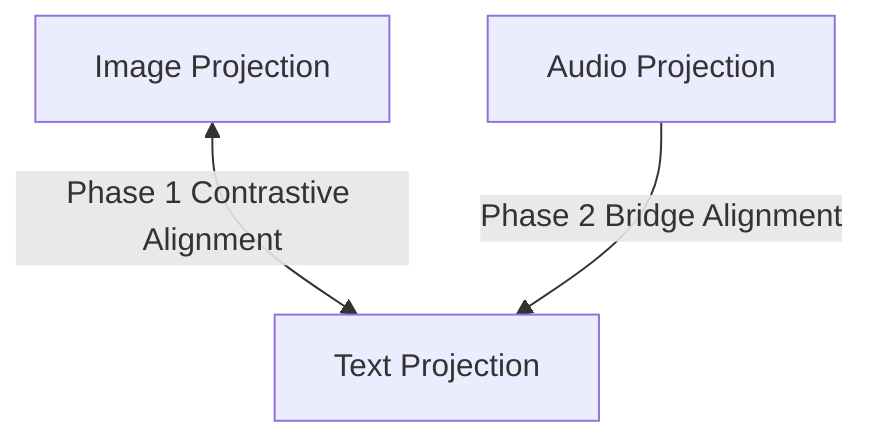

# Old Multimodal Pipeline (Before Prompt) Report
**Model Checkpoint**: `best_multimodal_pipeline_backup_old.pth`

This report outlines the dataset pairing logic, anchor mechanisms, loss functions, and recall metrics utilized in the codebase prior to the joint-training modifications.

---

## 1. Dataset Pairing & Structure
* **Pairing Mechanism**: Multimodal data is paired implicitly by mapping raw files to their corresponding **Species Class Labels** (e.g., species directories like `fin_whale` or `blue_whale`). 
* **Modality Alignment**: 
  - Image files are mapped to species indices.
  - Text descriptions (extracted from species documents) are mapped to species indices.
  - Audio clips are mapped to species indices.
* **Coverage Mismatch**: While 71 species have corresponding images and text files, only 32 species have audio clips. The baseline evaluation was corrected to only evaluate audio recall over the 32 species that actually contain audio files.

---

## 2. Anchor Setup: Image-Anchored Open Triangle
* **Anchor Setup**: The pipeline uses an **Image-Anchored** topology. Image projections act as the main anchors in the latent space.
* **Triangle Status**: **Open Triangle**. Modality alignment is split into two disjoint training phases. There is no direct Text-Audio alignment constraint during training; instead, the audio projection is bridged to the text projection.

---

*Phase 1 (Image pulls Text): The Image was the anchor. It pulled the Text embeddings towards it to align them.
*Phase 2 (Text pulls Audio): The Text was the anchor. It pulled the Audio embeddings towards it to align them.

Because Image never pulled Audio directly, the pipeline relied entirely on Text to hold everything together. The problem is that during Phase 1, the Text was being yanked

## 3. Loss Functions
* **Phase 1 (Image-Text Alignment)**:
  - **Supervised Contrastive Loss (SupCon)**: Multi-positive contrastive loss applied in one direction (Image -> Text), treating image embeddings as queries and text embeddings + memory bank targets as the search gallery.
  - **Loss Formulation**:
    $$L_{SupCon} = -\sum_{i \in I} \frac{1}{|P(i)|} \sum_{p \in P(i)} \log \frac{\exp(\text{sim}(z_i, z_p)/\tau)}{\sum_{a \in A(i)} \exp(\text{sim}(z_i, z_a)/\tau)}$$
    where $\tau = 0.07$ (sharpening temperature).
* **Phase 2 (Audio Bridge)**:
  - **Mean Cosine Distance Loss**: Instead of contrastive training, the audio head is optimized to minimize the cosine distance between the audio projection and the frozen text projection:
    $$L_{Bridge} = \text{mean}(1.0 - \cos(\text{proj\_aud}, \text{txt\_anchor}))$$

---

## 4. Evaluation Results (Test / Held-Out Data)
The baseline evaluation was run using corrected test metrics (calculating audio recall only on species possessing audio clips):

### Image -> Text Retrieval
* **Recall@1**: 71.61% (71.6%)
* **Recall@5**: 83.38% (83.4%)
* **Recall@10**: 89.26% (89.3%)
* **Composite Score**: 0.7691

### Image -> Audio Retrieval
* **Recall@1**: 67.36% (67.4%)
* **Recall@5**: 77.78% (77.8%)
* **Recall@10**: 84.03% (84.0%)
* **Composite Score**: 0.7215

### Overall Metrics
* **Overall Composite Score**: **0.7453 (74.5%)**
