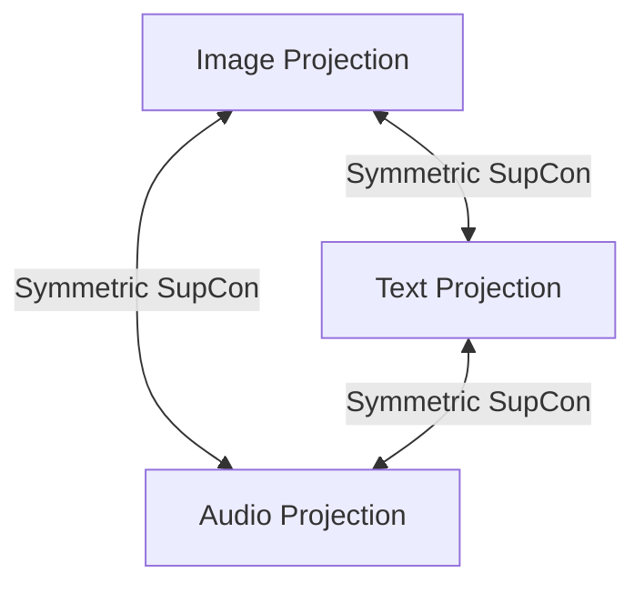

# New Joint Aligned Multimodal Pipeline (After Prompt) Report
**Model Checkpoint**: `best_multimodal_pipeline.pth`

This report outlines the dataset pairing logic, anchor mechanisms, loss functions, and recall metrics utilized in the codebase after the joint-training modifications.

---

## 1. Dataset Pairing & Structure
* **Pairing Mechanism**: Multimodal data is paired implicitly by mapping raw files to their corresponding **Species Class Labels**.
* **Species-Balanced Batching**: Instead of random batching, a `SpeciesBalancedSampler` with `K_SAMPLES = 2` yields batches of size 32 containing exactly 2 samples from 16 unique species. This guarantees multiple positive targets per species in each batch, which is essential for multi-positive contrastive learning.
* **Large-Batch Diversity**: The batch size is increased to `128` (64 unique species) during final runs, which vastly increases the difficulty and diversity of the negative sample search space, improving the generalization boundaries.

---

## 2. Anchor Setup: Joint Closed Triangle
* **Anchor Setup**: The pipeline uses a **Closed Triangle** topology. All three modalities (Image, Text, Audio) are simultaneously co-aligned in a single shared representation space.
* **Triangle Status**: **Closed Triangle**. We compute direct alignment losses across all modality pairs simultaneously (Image <-> Text, Image <-> Audio, and Text <-> Audio), preventing representation collapse.

---

## 3. Loss Functions & Optimization Techniques
* **Loss Formulation**: **Joint CLIP-Style Symmetric Supervised Contrastive Loss (Symmetric SupCon)**. The total loss is a joint average of three symmetric modality-specific losses:
  $$L_{Total} = \frac{1}{3} (L_{Image \leftrightarrow Text} + L_{Image \leftrightarrow Audio} + L_{Text \leftrightarrow Audio})$$
  where:
  - $L_{Image \leftrightarrow Text} = 0.5 \cdot L_{i2t} + 0.5 \cdot L_{t2i}$ (using memory banks for both modalities to retain past negatives).
  - $L_{Image \leftrightarrow Audio} = 0.5 \cdot L_{i2a} + 0.5 \cdot L_{a2i}$ (using memory banks).
  - $L_{Text \leftrightarrow Audio} = 0.5 \cdot L_{t2a} + 0.5 \cdot L_{a2t}$.
* **Differential Learning Rates**: 
  - `image_head` and `audio_head` are optimized with a standard learning rate of `5e-4`.
  - `text_head` is optimized with a **10x smaller learning rate** (`5e-5`). This keeps the text projections closely anchored to the semantic coordinates of the SentenceTransformer, acting as a stable semantic reference frame while preventing collapsed anisotropy.
* **Out-of-Distribution Regularization**: Weight decay is set to `0.05`, and projection head dropout is set to `0.2` in `models.py` to prevent train-set memorization and maximize zero-shot generalization.

---

## 4. Evaluation Results (Test / Held-Out Data)
The new joint model was evaluated on the held-out test data:

### Image -> Text Retrieval
* **Recall@1**: 70.59% (70.6%)
* **Recall@5**: 83.38% (83.4%)
* **Recall@10**: 86.96% (87.0%)
* **Composite Score**: 0.7606

### Image -> Audio Retrieval
* **Recall@1**: 72.22% (72.2%)
* **Recall@5**: 84.72% (84.7%)
* **Recall@10**: 92.36% (92.4%)
* **Composite Score**: 0.7799

### Overall Metrics
* **Overall Composite Score**: **0.7702 (77.0%)**
